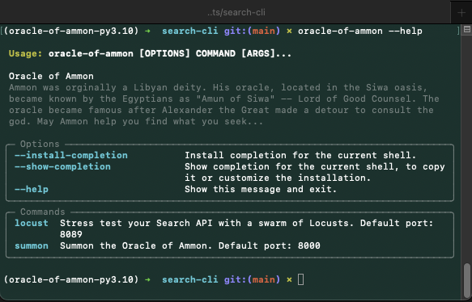
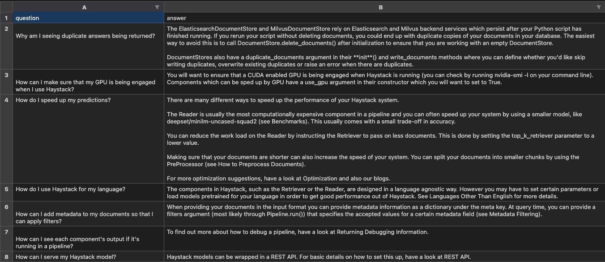
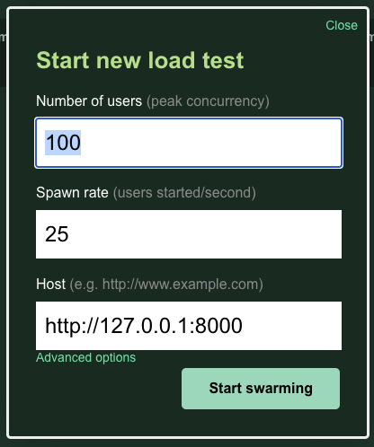

# Oracle of Ammon

[](https://pypi.org/project/oracle-of-ammon/)
[](https://pypi.org/project/oracle-of-ammon/)

A simple CLI tool for creating Search APIs.

## Installation

Creating a virtual environment is highly advised. To do so, run:

```bash
python3 -m venv .venv
source .venv/bin/activate
```

Once your environment is active, simply install the package with:

```bash
pip install oracle-of-ammon
```

## Usage

To get started, checkout the help menu:

```bash
oracle-of-ammon --help
```



Here, you will see we currently have two options: **summon** and **locust**.

### Summon

By default, Summon is configured to initialize an empty search service on port 8000. The API framework used is [FastAPI](https://fastapi.tiangolo.com/) and the underlying search engine is built on [Haystack](https://docs.haystack.deepset.ai/). If you would like to initialize the search service with documents upon startup, provide a filepath with the `--path` option. Once the service has been initialized, you can view the API docs at [http://127.0.0.1:8000/docs](http://127.0.0.1:8000/docs).

Supported filetypes: CSV, TSV, JSON, XLSX, TXT. For specific examples of each file extension, check out [this page](https://github.com/kmcleste/oracle-of-ammon/tree/main/oracle_of_ammon/data). Here's an example CSV file:

[](https://docs.haystack.deepset.ai/docs/faq)

### Locust

[Locust](https://locust.io/) is an open source tool for load testing. You're able to swarm your system with millions of simultaneous users -- recording service performance and other metrics. By default, Locust will start on port 8089. To start a new load test, simply enter the number of users you want to simulate, their spawn rate, and the host address to swarm.

[](https://locust.io)]
